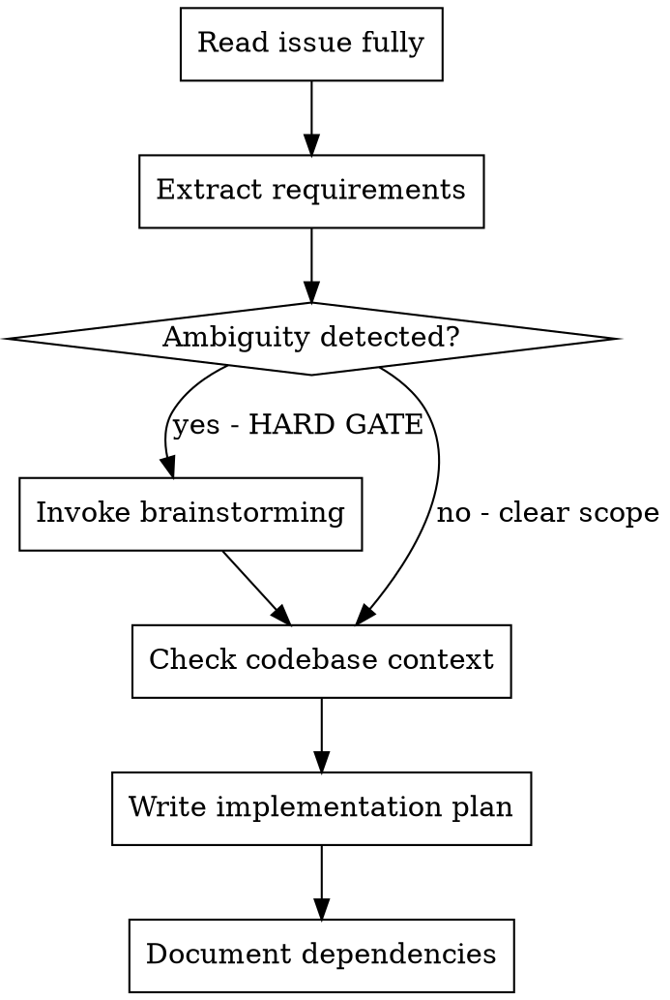
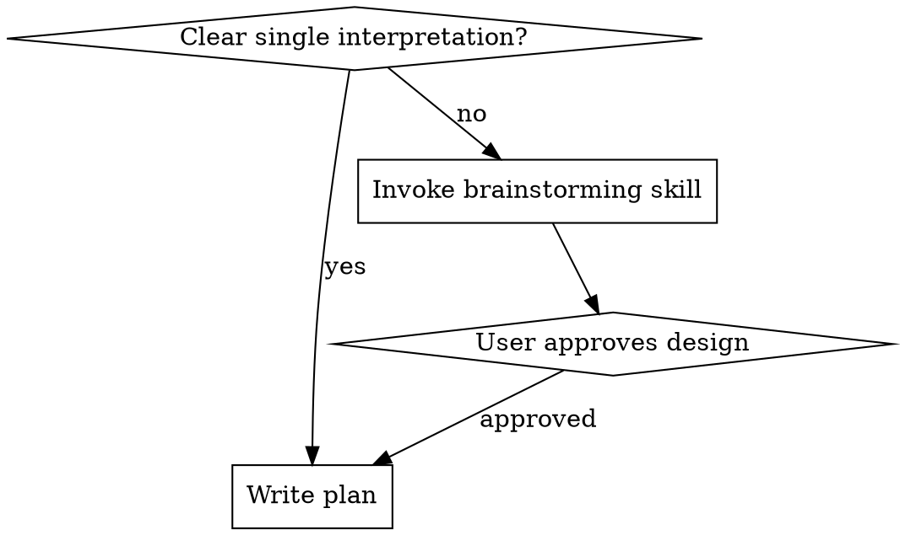

# Planning from GitHub Issues

Turn GitHub issues into executable implementation plans by systematically extracting requirements, exploring ambiguity, and grounding plans in codebase reality.

## Process Flow

## Step 1: Read the Issue Fully

**MUST read ALL of:**
- Issue title and body
- **Every comment** - decisions, edge cases, and requirements are often in the thread
- **Labels** - priority, component, type signals
- **Linked issues/PRs** - dependencies, related work, blocking items
- **Assignees/milestones** - scope and timeline context

**Hard rule:** Skipping comments is the #1 cause of incomplete plans. Comments contain the real requirements.

## Step 2: Extract Requirements

From the full issue context, extract:
- **Core requirement** - what must be built (one sentence)
- **Acceptance criteria** - explicit or implied success conditions
- **Constraints** - technical limits, performance requirements, compatibility
- **Dependencies** - other issues, PRs, or external services required
- **Ambiguities** - anything unclear that needs clarification

## Step 3: Ambiguity Gate

**IF ANY ambiguity detected, you MUST invoke brainstorming BEFORE writing the plan.**

Ambiguity includes:
- Vague requirements ("better error handling", "improve performance")
- Multiple valid interpretations
- Missing acceptance criteria
- Unclear user workflow
- Technical approach not specified

**This is a HARD GATE.** Do not write a plan until ambiguities are resolved through brainstorming.

## Step 4: Check Codebase Context

**BEFORE writing plan, check:**
1. **Project rules** - read `CLAUDE.md`, `AGENTS.md`, or equivalent
2. **Existing patterns** - how are similar features implemented?
3. **File structure** - where will new code live?
4. **Testing conventions** - test framework, patterns, location
5. **Architecture docs** - existing system design

**Never assume codebase conventions.** Verify before planning.

## Step 5: Write the Plan

Use the [`writing-plans`](writing-plans) skill to create the implementation plan.

**Include in plan:**
- Extracted requirements (from Step 2)
- Resolved ambiguities (from Step 3)
- Codebase context (from Step 4)
- **Dependency notes** - blocking issues, prerequisites
- **Risk flags** - uncertain areas, assumptions made

## Common Mistakes

| Mistake | Fix |
|---------|-----|
| Reading only issue title/body | Read every comment, label, linked issue |
| Skipping brainstorming for vague issues | Ambiguity = mandatory brainstorming |
| Planning without codebase context | Check project rules and existing patterns |
| Ignoring dependencies | Document blocking issues in plan |
| Vague plan steps under time pressure | Time pressure doesn't excuse incomplete plans |

## Rationalization Table

| Excuse | Reality |
|--------|---------|
| "Issue body has all I need" | Comments contain decisions and edge cases |
| "I'll check codebase while implementing" | Plan must reference actual file paths and patterns |
| "User said skip context check" | Verify anyway - user may not know project rules |
| "Deadline pressure means quick plan" | Bad plan wastes more time than thorough planning |
| "Dependencies are someone else's problem" | Plan must document blockers for the engineer |

## Red Flags - STOP and Reread Issue

- Planning without reading comments
- Skipping brainstorming for ambiguous requirements
- Writing file paths without checking existing structure
- Ignoring labels (priority/component signals)
- Not checking linked issues for dependencies

**When you see these, stop and follow the process flow.**
