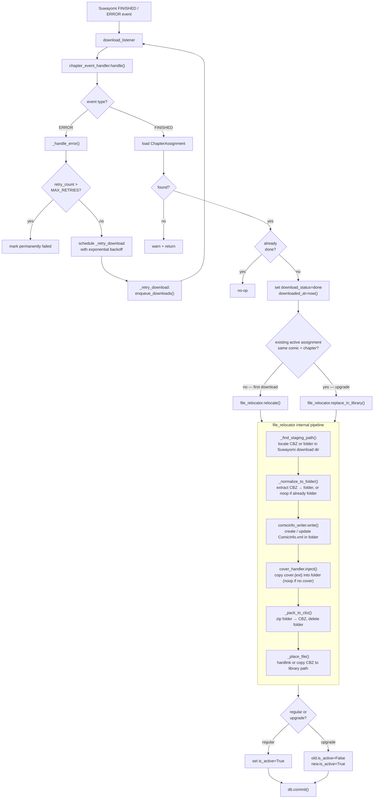

# Architecture

This document is aimed at new contributors. It covers every file in the project, the data model, key workflows, and how the pieces connect.

---

## Stack

| Layer | Technology |
|---|---|
| Backend | Python 3.11+, FastAPI (async) |
| Background jobs | APScheduler (in-process, no broker needed) |
| Database | SQLite via SQLAlchemy (ORM + Alembic migrations) |
| Suwayomi client | `gql` async GraphQL client (WebSocket subscriptions) |
| Image processing | OpenCV (`cv2`), Pillow, `imagehash` |
| Frontend | React + Vite, TanStack Query |

The backend is the only process that touches the filesystem or talks to Suwayomi. The frontend is a pure SPA that calls the backend REST API.

---

## High-Level Data Flow

```
User → Frontend → Backend API
                       │
                       ├─ Suwayomi GraphQL API  (queues downloads)
                       │
                       └─ GraphQL subscription  (download events)
                                │
                         chapter_event_handler
                                │
                    ┌───────────┼───────────┐
                    │           │           │
             quality_scanner  upgrade    file_relocator
             image_processor  check
```

Suwayomi's download folder is the **staging area**. Once a chapter is settled (scanned, upgraded if possible), `file_relocator` moves it to the configured **library path**.

---

## Project Layout

```
Otaki/
├── backend/
│   ├── app/
│   │   ├── main.py
│   │   ├── config.py
│   │   ├── database.py
│   │   ├── models/
│   │   ├── api/
│   │   ├── services/
│   │   └── workers/
│   ├── watermarks/        (bind-mounted as /app/watermarks in Docker)
│   └── requirements.txt
├── covers/                (bind-mounted as /app/covers in Docker)
├── frontend/
│   ├── src/
│   │   ├── api/           (apiFetch client)
│   │   ├── context/       (AuthContext)
│   │   ├── pages/
│   │   ├── components/
│   │   ├── App.tsx        (router + RequireAuth guard)
│   │   └── main.tsx       (QueryClient + AuthProvider mount)
│   ├── Dockerfile
│   └── package.json
├── docker/
│   ├── docker-compose.yml
│   └── nginx.conf
├── docs/
│   └── ARCHITECTURE.md        <- you are here
├── .env.example
└── README.md
```

---

## Backend Files

### Entry & Config

#### `backend/app/main.py`
FastAPI app entry point. Responsibilities:
- Mount all API routers (`/api/setup`, `/api/auth`, `/api/search`, `/api/requests`, `/api/settings`)
- Call `database.init()` on startup (runs `alembic upgrade head` to apply any pending migrations)
- Start APScheduler via `scheduler.start(db)` then start `download_listener` as a long-lived background task
- Cancel `download_listener` task and shut down APScheduler on shutdown

Two middleware functions run on every request (last registered runs first):

1. **`require_setup`** (runs first) — blocks non-exempt routes with 503 until `SETUP_COMPLETE=True` is written to the env file. Exempt prefix: `/api/setup`, `/api/auth`, `/docs`, `/openapi.json`, `/redoc`.
2. **`require_auth_middleware`** (runs second) — blocks non-exempt routes with 401 if no valid JWT is present in the `Authorization: Bearer` header or `otaki_session` cookie. Validates signature only (no DB lookup). Same exempt prefix as above.

#### `backend/app/config.py`
Reads the env file using Pydantic `BaseSettings`. Exposes a singleton `settings` object used everywhere else. Fields: `SETUP_COMPLETE` (bool, default `False`), `DATABASE_URL`, `SECRET_KEY`, `DEFAULT_POLL_DAYS`, `SUWAYOMI_URL`, `SUWAYOMI_USERNAME`, `SUWAYOMI_PASSWORD`, `SUWAYOMI_DOWNLOAD_PATH`, `LIBRARY_PATH`, `CHAPTER_NAMING_FORMAT`, `RELOCATION_STRATEGY`, `DOWNLOAD_POLL_FALLBACK_SECONDS`, `MAX_RECONNECT_ATTEMPTS`, `MAX_DOWNLOAD_RETRIES` (default 2).

The path of the env file is resolved at module load time from the `ENV_FILE` environment variable (defaults to `.env`). In Docker, `ENV_FILE` is set to `/app/data/.env` so the env file lives inside the writable `data/` volume rather than the read-only `/app` directory.

#### `backend/app/database.py`
SQLAlchemy `AsyncEngine` + `AsyncSession` setup. Exports:
- `init()` — creates all tables
- `get_db` — FastAPI dependency that yields a session per request

---

### Models

#### `backend/app/models/comic.py`
`Comic` — one row per tracked title. Source is tracked per chapter (via `ChapterAssignment`), not per comic.

| Column | Type | Notes |
|---|---|---|
| `id` | int PK | |
| `title` | str | Display name in Otaki UI |
| `library_title` | str | Canonical name used for folder path and `ComicInfo.xml` `<Series>` tag; set at request time, defaults to `primary_title` |
| `cover_path` | str \| null | Absolute path to the stored cover image under `COVERS_PATH`; `null` if no cover was provided at request creation |
| `status` | enum | `tracking` / `complete` |
| `poll_override_days` | float | Days between new-chapter polls; defaults to `DEFAULT_POLL_DAYS` (7) |
| `upgrade_override_days` | float \| null | Days between upgrade checks; `null` = use `poll_override_days` |
| `next_poll_at` | datetime \| null | When Otaki will next poll for new chapters |
| `next_upgrade_check_at` | datetime \| null | When Otaki will next run upgrade checks |
| `last_upgrade_check_at` | datetime \| null | When upgrade checks last ran |
| `created_at` | datetime | |

#### `backend/app/models/source.py`
`Source` — user's ranked list of Suwayomi extensions.

| Column | Type | Notes |
|---|---|---|
| `id` | int PK | |
| `suwayomi_source_id` | str | Suwayomi's source ID string |
| `name` | str | Human-readable label |
| `priority` | int | 1 = best/most preferred |
| `enabled` | bool | |
| `created_at` | datetime | |

#### `backend/app/models/chapter_assignment.py`
`ChapterAssignment` — tracks which source each chapter was downloaded from. Multiple rows per chapter during an upgrade; only one has `is_active=true` at any time.

| Column | Type | Notes |
|---|---|---|
| `id` | int PK | |
| `comic_id` | int FK → comics | |
| `chapter_number` | float | e.g. 12.5 for half-chapters |
| `volume_number` | int nullable | |
| `source_id` | int FK → sources | |
| `suwayomi_manga_id` | str | May differ from comic's current ID during upgrade |
| `suwayomi_chapter_id` | str | |
| `download_status` | enum | `queued` / `downloading` / `done` / `failed` |
| `is_active` | bool | True for the canonical copy |
| `chapter_published_at` | datetime | `uploadDate` from Suwayomi source metadata — used for cadence inference |
| `downloaded_at` | datetime nullable | |
| `library_path` | str nullable | Absolute path in `LIBRARY_PATH` after relocation |
| `relocation_status` | enum | `pending` / `done` / `failed` / `skipped` |
| `retry_count` | int | Number of retry attempts made after download failures; starts at 0 |

#### `backend/app/models/quality_scan.py`
Two tables:

**`QualityScan`** — result of scanning one chapter.

| Column | Type | Notes |
|---|---|---|
| `id` | int PK | |
| `chapter_assignment_id` | int FK | |
| `scanned_at` | datetime | |
| `watermark_count` | int | |
| `watermark_templates_matched` | JSON | List of `watermark_template.id` |
| `has_header` | bool | |
| `has_footer` | bool | |
| `severity` | enum | `clean` / `minor` / `moderate` / `severe` |
| `auto_fixed` | bool | Whether image_processor ran |

**`User`** — Otaki user account.

| Column | Type | Notes |
|---|---|---|
| `id` | int PK | |
| `username` | str | |
| `email` | str | |
| `password_hash` | str \| null | Null for SSO-only accounts |
| `sso_provider` | str \| null | e.g. `"google"`, `"github"`, or OIDC issuer URL |
| `sso_sub` | str \| null | Provider's subject identifier |
| `role` | enum | `reader` / `requestor` / `admin` |
| `created_at` | datetime | |

**`ComicAlias`** — all known titles for a comic. Searched when polling sources for new chapters.

| Column | Type | Notes |
|---|---|---|
| `id` | int PK | |
| `comic_id` | int FK → comics | |
| `title` | str | Title as known on this source |
| `source_id` | int FK nullable | Which source uses this title; `null` = applies to all |

**`ComicSourceOverride`** — per-comic source priority overrides, takes precedence over global source priority for that comic.

| Column | Type | Notes |
|---|---|---|
| `id` | int PK | |
| `comic_id` | int FK → comics | |
| `source_id` | int FK → sources | |
| `priority_override` | int | Lower = more preferred; replaces global priority for this comic |

**`WatermarkTemplate`** — metadata for a saved template image.

| Column | Type | Notes |
|---|---|---|
| `id` | int PK | |
| `name` | str | |
| `source_id` | int FK nullable | Which source this watermark belongs to |
| `file_path` | str | Relative to `WATERMARKS_PATH` |
| `match_threshold` | float | 0.0–1.0; default 0.8 |
| `enabled` | bool | |

---

### API Routers

#### `backend/app/api/auth.py`
Authentication endpoints. Sessions are JWT-based (HS256, 24h expiry). Crypto helpers live in `services/auth.py`.

- `POST /api/auth/login` — accepts `{username, password}`, validates against `users` table, returns `{access_token, token_type}`
- `POST /api/auth/logout` — 200 no-op; client discards the token (stateless JWT)
- `GET /api/auth/me` — reads `Authorization: Bearer <token>`, returns `{id, username}`

**`require_auth` dependency** — validates JWT and injects the active `User` into route handlers. Accepts token from `Authorization: Bearer` header or `otaki_session` cookie. Raises 401 on missing, invalid, or expired tokens. Use as `user: User = Depends(require_auth)`.

**Not yet implemented (future issues):**
- `GET /api/auth/callback` — OAuth2/OIDC redirect handler (#future)
- Role-based `require_permission` dependency — post-MVP

#### `backend/app/services/auth.py`
Shared bcrypt + JWT helpers used by both `setup.py` and `auth.py`.

- `hash_password(password)` — bcrypt hash
- `verify_password(plain, hashed)` — constant-time bcrypt compare
- `create_token(user_id)` — encodes `{sub, exp}` as signed JWT
- `decode_token(token)` — decodes and verifies; raises `jwt.InvalidTokenError` on failure

#### `backend/app/api/setup.py`
First-time setup wizard endpoints. All endpoints except `GET /setup/complete` and `POST /setup/user` are guarded by `require_setup_incomplete`, which raises 409 once `SETUP_COMPLETE=True` is set. `POST /api/setup/user` has no such guard — user creation is idempotent (returns 409 if any user already exists, which the wizard uses as a signal to auto-login). Wizard step order:

1. `GET /api/setup/complete` — public, no auth. Returns `{complete: bool}`. Used by `App.tsx` on mount to decide whether to show the wizard or the normal app.
2. `GET /api/setup/status` — requires `require_auth`. Returns full current config state (`complete`, `admin_created`, `suwayomi_url`, `suwayomi_username`, `download_path`, `library_path`) so the wizard can pre-fill fields on re-entry.
3. `POST /api/setup/user` — creates the first admin user; 409 "Admin user already exists" if any user exists (wizard auto-logins on this response)
4. `POST /api/setup/connect` — accepts `{url, username, password}`, calls `validate_suwayomi()` from `services/settings.py`, saves credentials via `write_env()`
5. `GET /api/setup/sources` — calls `suwayomi.list_sources()` and returns installed sources for priority ordering
6. `POST /api/setup/sources` — accepts an ordered list of source IDs, creates `Source` rows with assigned priorities
7. `POST /api/setup/paths` — accepts `{download_path, library_path, create: bool}`. Two-phase flow:
   - If `create=false` (default) and any path doesn't exist: returns 400 with `{code: "directories_missing", missing: [{field, path}]}`. The wizard shows a confirmation screen.
   - If `create=true`: calls `Path.mkdir(parents=True, exist_ok=True)` for each path; 400 on `PermissionError`/`OSError`.
   - On success: saves paths and writes `SETUP_COMPLETE=True` via `write_env()`.

Write/validate helpers are shared with `api/settings.py` — see `services/settings.py`.

#### `backend/app/api/settings.py`
`GET /api/settings` and `PATCH /api/settings`. Accessible by any authenticated user.

- `GET /api/settings` — returns all current settings; `SUWAYOMI_PASSWORD` is returned as `"**masked**"` if set or `null` if unset.
- `PATCH /api/settings` — partial update; accepts any subset of fields. If any Suwayomi connection field is included, pings Suwayomi with the resulting credentials before saving (400 on failure). Path fields are validated as existing directories before saving. Each accepted field is persisted via `write_env()` from `services/settings.py`.

#### `backend/app/api/search.py`
- `GET /api/search?q=<title>` — fans out to all enabled sources via `suwayomi.search_source()` in parallel. Requires auth. Returns all results without deduplication, including `source_id` and `source_name` per result. `cover_url` is rewritten to `/api/search/thumbnail?url=...` so the browser never fetches from Suwayomi directly.
- `GET /api/search/thumbnail?url=` — thumbnail proxy: validates `url` starts with `SUWAYOMI_URL`, fetches from Suwayomi with Basic auth, streams image back. Returns 400 for disallowed URLs, 502 on upstream failure.

#### `backend/app/api/requests.py`
CRUD for tracked comics.

- `POST /api/requests` — accepts `{primary_title, library_title?, cover_url?, poll_override_days?, upgrade_override_days?}`. Duplicate-title check (409), creates `Comic`, calls `source_selector.build_chapter_source_map()`, calls `suwayomi.fetch_chapters()` per source group, creates `ChapterAssignment` rows (`download_status=queued`, `is_active=True`), calls `suwayomi.enqueue_downloads()`, sets `next_poll_at` / `next_upgrade_check_at`, registers APScheduler jobs via `scheduler.register_comic_jobs()`. If `cover_url` is set, calls `cover_handler.save_from_url()` and stores the result in `comic.cover_path`. Returns `201 ComicResponse`.
- `GET /api/requests` — list all tracked comics with per-comic chapter counts by download status (`total`, `done`, `downloading`, `queued`, `failed`). Uses a single `GROUP BY` query across all comics.
- `GET /api/requests/{id}` — full detail: comic metadata plus list of `ChapterSummary` rows ordered by chapter number (includes source name, download status, relocation status, library path).
- `PATCH /api/requests/{id}` — partial update; applies only fields present in the request body. `poll_override_days`/`upgrade_override_days` changes advance the corresponding `next_*_at` and call `scheduler.register_comic_jobs`. `status=complete` calls `scheduler.remove_comic_jobs`; `status=tracking` re-registers jobs.
- `GET /api/requests/{id}/cover` — serves the comic's cover image as a file response. Returns 404 if no cover has been stored.
- `DELETE /api/requests/{id}?delete_files=false` — untrack a comic: removes APScheduler jobs via `scheduler.remove_comic_jobs()`, bulk-deletes all `ChapterAssignment` rows, deletes the `Comic` row. If `delete_files=true`, also unlinks any existing `library_path` files. Returns 204.

#### `backend/app/api/sources.py`
- `GET/POST/PATCH/DELETE /api/sources` — source priority list CRUD
- `POST /api/sources/watermarks` — accepts a multipart upload (image file + `x, y, w, h, name, source_id`) and calls `template_extractor.extract_template()`
- `GET/DELETE /api/sources/watermarks/{id}` — list and remove templates

#### `backend/app/api/quality.py`
- `GET /api/quality/{comic_id}` — per-chapter scan results
- `POST /api/quality/{assignment_id}/rescan` — re-runs `quality_scanner.scan_chapter()` on the existing CBZ
- `POST /api/quality/{assignment_id}/autofix` — manually runs `image_processor.crop_chapter()`
- `POST /api/quality/{assignment_id}/relocate` — manually re-triggers relocation

---

### Services

#### `backend/app/services/settings.py`
Shared write/validate helpers used by both `api/setup.py` and `api/settings.py`.

- `write_env(key, value)` — persists a setting: reads the env file path from the `ENV_FILE` environment variable (defaults to `.env`), calls `dotenv.set_key(env_file, key, str(value))`, then `setattr(settings, key, value)` with the raw (uncoerced) value so in-memory types are preserved. Using `ENV_FILE` ensures the temp files that `python-dotenv` creates during writes land in a writable directory (important in Docker where `/app` is not writable but `/app/data` is).
- `validate_suwayomi(url, username, password)` → bool — delegates to `suwayomi.ping()`.

#### `backend/app/services/suwayomi.py`
Async GraphQL client. All Suwayomi communication goes through here — nothing else should import `gql` directly. All Suwayomi operations that fetch remote data use GraphQL mutations (Suwayomi triggers a live fetch), not queries.

Implemented:
- `ping(url, username, password)` → bool — verifies connectivity; used by setup wizard
- `list_sources()` → `list[{id, name, lang, icon_url}]` — installed sources; used by setup wizard
- `search_source(source_id, query)` → `list[{manga_id, title, cover_url, synopsis, url}]` — searches a single source by title string; `manga_id` is a string; `cover_url`, `synopsis`, and `url` may be null
- `fetch_chapters(manga_id)` → `list[{chapter_number, volume_number, suwayomi_chapter_id, chapter_published_at}]` — fetches all chapters for a manga from Suwayomi. `uploadDate` is a ms-epoch string; converted to `datetime` (UTC). `volume_number` is always `None` (not exposed by Suwayomi's chapter API).
- `enqueue_downloads(chapter_ids)` → void — enqueues a list of chapter IDs for download via `enqueueChapterDownloads` mutation.
- `subscribe_download_changed()` → async generator of `(event_type, chapter_id, chapter_name, manga_title, source_display_name)` tuples — maintains a `graphql-transport-ws` WebSocket subscription to Suwayomi's `downloadStatusChanged(input: DownloadChangedInput!)` subscription. Yields one tuple per `FINISHED` or `ERROR` event (checked via `DownloadUpdate.type`). On the first event, also yields any entries in the `initial` field with `state` of `FINISHED` or `ERROR`.
- `poll_downloads()` → `list[dict]` — GraphQL fallback used when the WebSocket subscription is unavailable. Queries `downloadStatus { queue { state chapter { id name } manga { title source { displayName } } } }` and returns all queue items as `{state, chapter_id, chapter_name, manga_title, source_name}` dicts. Callers infer FINISHED/ERROR events by diffing snapshots — items that disappear from the queue are assumed complete.

Not yet implemented:
- `add_to_library(source_id, manga_url)` → Suwayomi manga ID (deferred — not required for download flow)

#### `backend/app/services/source_selector.py`
Per-chapter source selection logic. Stateless — takes a DB session as argument.

- `effective_priority(source, comic, db) → int` — async; returns `source.priority` for MVP. Stubbed as `async def` so callers need no changes when 1.3 adds `ComicSourceOverride` lookup.
- `build_chapter_source_map(comic, db)` → `dict[float, tuple[Source, str, dict]]` — fans out to all enabled sources in parallel. For each source: searches using `comic.title` first; if no matching result is found in the response, retries the search with each `ComicAlias` title in turn until a match is found. `_find_matching_result` performs case-insensitive title comparison against the full alias set (`comic.title` + all alias titles). Returns `{chapter_number: (best_source, suwayomi_manga_id, chapter_data)}`. All three values are bundled so callers can create `ChapterAssignment` rows and call `enqueue_downloads` without any additional Suwayomi round-trips. Sources that error during fetch are skipped with a warning log. Uses `asyncio.gather` with `return_exceptions=False` per source coroutine.
- `find_upgrade_candidates(comic, db)` → `list[tuple[ChapterAssignment, Source, str, dict]]` — loads active assignments (with source eager-loaded), calls `build_chapter_source_map`, returns `(assignment, candidate_source, manga_id, chapter_data)` tuples where a better-priority source now has the chapter. `chapter_data` contains everything needed to create a new `ChapterAssignment` and enqueue the download.

#### `backend/app/services/cadence_inferrer.py`
Infers release cadence from chapter history.

- `infer_cadence(comic_id, db) → float | None` — queries `chapter_published_at` (not `downloaded_at`) for all active `ChapterAssignment` rows for the comic, sorted ascending, and computes the median inter-chapter gap in days. Using source publication dates means bulk-downloading a back-catalogue produces a sensible cadence immediately, rather than clustering all gaps near zero. Hiatus-aware: gaps more than 3× the initial median are excluded before the final median is computed. Returns `None` if fewer than 2 chapters exist. Called at request time (to initialise `inferred_cadence_days`) and after each poll job when new chapters are found.

#### `backend/app/services/quality_scanner.py`
Image quality analysis. Does **not** modify files.

- `scan_chapter(cbz_path) → ScanResult` — opens CBZ, extracts first and last images only (banners only appear there). For each: runs `cv2.matchTemplate` against all enabled templates; computes pHash of top/bottom 80px and compares against known banner hashes.
- `compute_severity(scan_result) → Severity` — `clean` if no matches; `minor` for isolated watermarks; `moderate` for watermarks or single banner; `severe` for both.

Watermark templates are loaded once at startup and cached in memory.

#### `backend/app/services/cover_handler.py`
Manages per-comic cover images.

- `save_from_url(comic_id, url) → Path | None` — downloads the image at `url` and saves it to `COVERS_PATH/{comic_id}.{ext}`. Returns the saved path on success, `None` on failure. Called by `create_request` when a `cover_url` is provided.
- `save_from_file(comic_id, content, content_type) → Path | None` — saves uploaded image bytes to `COVERS_PATH/{comic_id}.{ext}`, deriving extension from `content_type`. Returns `None` if `content_type` is not `image/*`.
- `inject(folder, comic)` — if `comic.cover_path` is set and the file exists, copies it into *folder* as `cover.{ext}` (preserving original extension, e.g. `cover.jpg`). No-op if `comic.cover_path` is null or file missing. Called by `file_relocator` after `comicinfo_writer.write` and before `_pack_to_cbz`.

#### `backend/app/services/comicinfo_writer.py`
Writes or updates `ComicInfo.xml` inside a chapter folder before it is packed to CBZ, ensuring all chapters of a comic report the same series name to comic library software (Komga, Kavita, etc.).

- `write(folder, comic, assignment)` — looks for `ComicInfo.xml` in *folder*; if present, parses it with `xml.etree.ElementTree`; if absent, creates a new `<ComicInfo/>` element. Sets the target fields, preserves all other existing tags, then writes the result back to `folder / "ComicInfo.xml"`. Called by `file_relocator` after `_normalize_to_folder` and before `_pack_to_cbz`.

Fields written to `ComicInfo.xml`:

| Field | Value |
|---|---|
| `<Series>` | `comic.library_title` |
| `<Number>` | `str(assignment.chapter_number)` |
| `<Volume>` | `str(assignment.volume_number)` (element omitted entirely if null) |

Any other existing fields are preserved unchanged.

#### `backend/app/services/template_extractor.py`
Creates templates from user-supplied pages.

- `extract_template(image_bytes, x, y, w, h, name, source_id, db) → WatermarkTemplate` — crops the region using Pillow, saves as PNG to `WATERMARKS_PATH/{name}.png`, inserts a `WatermarkTemplate` row, invalidates the in-memory template cache in `quality_scanner`.

#### `backend/app/services/image_processor.py`
Modifies CBZ files to remove banners. **Mutates files** — always backs up first.

- `crop_chapter(cbz_path, scan_result)` — renames original to `*.cbz.orig`, re-packs CBZ with first page top-cropped and/or last page bottom-cropped at the boundary detected by `scan_result`. Boundary detection uses pixel-row variance: the first row with high variance after the uniform banner region.

#### `backend/app/services/file_relocator.py`
Moves settled chapters from Suwayomi's staging folder to the final library. Radarr/Sonarr-style.

**Pipeline (called by `relocate` and `replace_in_library`):**
1. `_find_staging_path` — locate the chapter in the download area (CBZ or folder)
2. `_normalize_to_folder` — extract CBZ to a sibling folder if needed; no-op if already a folder
3. `comicinfo_writer.write` — inject/update `ComicInfo.xml` in the folder
4. `_pack_to_cbz` — zip the folder to a CBZ, delete the folder
5. Place the CBZ at the destination (hardlink or copy) and update the assignment

Public API:

- `resolve_path(assignment, comic) → Path` — renders `CHAPTER_NAMING_FORMAT` with tokens `{title}` (uses `comic.library_title`), `{chapter}` (zero-padded float), `{volume}` (optional), `{year}`, `{source}`. Returns absolute path under `LIBRARY_PATH`.
- `relocate(assignment, comic, db, ...)` — runs the pipeline; resolves destination, creates parent dirs, places the CBZ. Updates `assignment.library_path` and `assignment.relocation_status=done`.
- `replace_in_library(old_assignment, new_assignment, comic, db, ...)` — used during upgrades when `old_assignment.library_path` is set. Runs the pipeline then `os.replace()` for atomic swap. No window where the file is missing.

Internal helpers:

- `_find_staging_path(chapter_name, manga_title, source_display_name) → Path | None` — looks in `SUWAYOMI_DOWNLOAD_PATH/{source}/{manga}/` for the chapter staging area. Detection order: exact CBZ match → single CBZ fallback → CBZ prefix match → exact folder match → single subdirectory fallback → folder prefix match. Returns the path (file or directory) or `None`.
- `_normalize_to_folder(staging) → Path` — if *staging* is a directory, returns it unchanged. If it is a `.cbz` file, extracts all contents to `staging.parent / staging.stem /`, deletes the original CBZ, and returns the new folder.
- `_pack_to_cbz(folder) → Path` — collects all files in *folder* recursively, sorts them by relative path (alphabetical — matches Suwayomi's zero-padded page-number naming), writes a new CBZ at `folder.parent / (folder.name + ".cbz")`, deletes the folder, and returns the CBZ path.

---

### Workers

#### `backend/app/workers/scheduler.py`
Initialises APScheduler with an `AsyncIOScheduler` module-level singleton. All jobs use the `date` trigger — each job re-schedules itself when it finishes.

**Interval priority chain**

Each comic has two scheduled jobs (poll and upgrade). The interval for each is determined by the first non-null value in the following chain:

| Job | Priority order |
|---|---|
| Poll | `poll_override_days` → `inferred_cadence_days` → `DEFAULT_POLL_DAYS` |
| Upgrade | `upgrade_override_days` → `inferred_cadence_days` → `poll_override_days` → `DEFAULT_POLL_DAYS` |

- `poll_override_days` is null unless the user has explicitly set a value. Setting it always takes precedence over inference.
- `inferred_cadence_days` is computed by `cadence_inferrer` from the median gap between `chapter_published_at` values. Updated at request time (if chapters are found) and after each poll that discovers new chapters.
- `DEFAULT_POLL_DAYS` is the system-wide fallback (configured in settings).

Public API:

- `start(db: AsyncSession) → None` — loads all comics with `status=tracking`, registers poll and upgrade jobs for each, then calls `scheduler.start()`. Called from `main.py` lifespan on startup.
- `register_comic_jobs(comic: Comic) → None` — registers poll and upgrade jobs for a newly created comic. Called by `POST /api/requests` after committing the new `Comic` row.
- `remove_comic_jobs(comic_id: int) → None` — removes all APScheduler jobs for a comic (poll and upgrade). Called by `DELETE /api/requests/{id}`. `JobLookupError` is silently suppressed — safe to call even if jobs were never registered.

Internal:

- `_effective_poll_days(comic)` — returns the effective poll interval using the priority chain above.
- `_effective_upgrade_days(comic)` — returns the effective upgrade interval using the priority chain above.
- `_register_poll_job(comic)` — calls `scheduler.add_job` with `trigger="date"`, `run_date=comic.next_poll_at` (or `now(UTC)` if unset), `id=f"poll_{comic.id}"`, `replace_existing=True`.
- `_poll_comic(comic_id)` — opens a fresh `AsyncSessionLocal` session. Loads the comic; returns early if not found or `status=complete`. Calls `build_chapter_source_map`, compares against existing active `ChapterAssignment` chapter numbers, creates `ChapterAssignment` rows directly from the chapter data in the map (`download_status=queued`, `is_active=True`), calls `enqueue_downloads`. If new chapters were found, commits and re-infers cadence (`cadence_inferrer.infer_cadence`). Advances `comic.next_poll_at` by `_effective_poll_days`, re-registers the job, and commits.
- `_register_upgrade_job(comic)` — same shape as `_register_poll_job`; uses `comic.next_upgrade_check_at`, `id=f"upgrade_{comic.id}"`.
- `_upgrade_comic(comic_id)` — opens a fresh `AsyncSessionLocal` session. Loads the comic; returns early if not found or `status=complete`. Calls `find_upgrade_candidates`; for each `(assignment, candidate_source, manga_id, ch_data)` creates a new `ChapterAssignment` (`is_active=False`, `download_status=queued`) on the better source and enqueues the download. For 1.0, always upgrades — no quality condition. Advances `comic.last_upgrade_check_at` and `comic.next_upgrade_check_at` by `_effective_upgrade_days`, re-registers the job, and commits. The actual swap (`is_active` flip + library file replace) is handled by `chapter_event_handler` when the upgrade download completes.

#### `backend/app/workers/download_listener.py`
Maintains a persistent WebSocket connection to Suwayomi's `downloadStatusChanged` GraphQL subscription. On each `FINISHED` or `ERROR` event (via `DownloadUpdate.type`), dispatches to `chapter_event_handler.handle(event_type, chapter_id, chapter_name, manga_title, source_display_name)` as a non-blocking `asyncio.create_task()` so slow relocations don't block the listener.

State machine:
- **Startup**: calls `_seed_poll()` once to snapshot the current Suwayomi download queue into `_polled_items`, then calls `reconcile_on_startup()` to dispatch FINISHED events for any chapters the DB shows as `queued`/`downloading` that are no longer in the Suwayomi queue (i.e. completed while the backend was down). The idempotency guard in `chapter_event_handler.handle()` silently no-ops for chapters already processed.
- **SUBSCRIPTION mode** (default): connect via `subscribe_download_changed()`; on error, retry with exponential backoff (2s, 4s, 8s… capped at 30s). After `MAX_RECONNECT_ATTEMPTS` consecutive failures, switch to POLLING mode.
- **POLLING mode** (fallback): call `poll_downloads()` every `DOWNLOAD_POLL_FALLBACK_SECONDS`. Compares the current queue snapshot against `_polled_items`: items that disappeared are dispatched as FINISHED; items with state ERROR are dispatched as ERROR (once, deduplicated). On first successful poll, switch back to SUBSCRIPTION mode.

Started by `main.py` lifespan as `asyncio.create_task(download_listener.run())` and cancelled on shutdown. Runs for the lifetime of the process regardless of whether Otaki has active downloads — unrecognised chapter IDs (downloads not initiated by Otaki) are silently ignored in `chapter_event_handler`.

#### `backend/app/workers/chapter_event_handler.py`
Orchestrates the post-download pipeline and retry logic. Does not drive upgrade or
poll scheduling — those are APScheduler jobs.

```
handle(event_type, suwayomi_chapter_id, chapter_name, manga_title, source_display_name)
  ERROR   → _handle_error()
  FINISHED →
    1. Load ChapterAssignment by suwayomi_chapter_id (warn + return if not found)
    2. Idempotency check: if download_status already done → return
    3. Set download_status=done, downloaded_at=now(UTC)
    4. [deferred 1.4] scan  → quality_scanner.scan_chapter()
    5. [deferred 1.4] write → QualityScan row
    6. [deferred 1.4] fix   → image_processor.crop_chapter() (if AUTO_FIX_BANNERS)
    7. Check for upgrade: query for existing active ChapterAssignment with same
       comic_id + chapter_number but different id
       - None found → file_relocator.relocate()      → set is_active=True
       - Found      → file_relocator.replace_in_library(old, new)
                      → set old.is_active=False, new.is_active=True
    8. db.commit()

file_relocator.relocate() and replace_in_library() both run this internal pipeline:
    a. _find_staging_path()          find CBZ or folder in Suwayomi download dir
    b. _normalize_to_folder()        extract CBZ → folder, or noop if already a folder
    c. comicinfo_writer.write()      create/update ComicInfo.xml in the folder
    d. cover_handler.inject()                  copy cover.{ext} into the folder (noop if no cover)
    e. _pack_to_cbz()                zip folder → CBZ, delete folder
    f. _place_file()                 hardlink or copy CBZ to library path

on upgrade download (1.0): always swap — no quality condition until scanner added in 1.4
on upgrade download (1.4+): swap only if new severity ≤ old severity

_handle_error(suwayomi_chapter_id, ...)
  1. Load ChapterAssignment (warn + return if not found)
  2. Set download_status=failed, increment retry_count
  3. If retry_count > MAX_DOWNLOAD_RETRIES → log error, commit, return (permanently failed)
  4. Compute delay: min(300 * 2^(retry_count-1), 86400) seconds
     (5 min → 10 min → 20 min → … capped at 24 h)
  5. Schedule _retry_download via APScheduler date trigger at now + delay

_retry_download(assignment_id, suwayomi_chapter_id)
  Scheduled by _handle_error. Sets download_status=queued, calls
  suwayomi.enqueue_downloads(). If enqueue raises, reverts status to failed.
```

**Post-download pipeline flow:**



---

## Frontend Shell

#### `frontend/src/main.tsx`
App entry point. Mounts `QueryClientProvider` (staleTime 30s, retry 1) wrapping `AuthProvider` wrapping `App`.

#### `frontend/src/App.tsx`
On mount, fetches `GET /api/setup/complete` and stores the result in state. Returns `null` while this check is in flight to avoid a flash of the wrong route tree. Once resolved, renders one of two completely separate `BrowserRouter`+`Routes` trees:

- **Setup incomplete** — every path routes to `/setup` (via a catch-all `<Navigate to="/setup" replace />`). Renders `<Setup onComplete={...} />`, which calls `setSetupComplete(true)` when the wizard finishes, switching to the complete tree in-memory without a page reload.
- **Setup complete** — normal app routing. `/setup` redirects to `/login`. All non-public routes are wrapped in `RequireAuth`, which redirects to `/login` when `isAuthenticated` is false.

#### `frontend/src/context/AuthContext.tsx`
Stores the JWT in `localStorage` under key `otaki_token`. Exposes `{ token, isAuthenticated, login(token), logout() }` via `useAuth()`. Throws if `useAuth()` is called outside `AuthProvider`.

#### `frontend/src/api/client.ts`
`apiFetch<T>(path, options?)` — reads token from localStorage, injects `Authorization: Bearer` header, parses JSON response. Returns `undefined as T` for 204. Throws `ApiError` (with `.status`) on non-2xx.
`extractDetail(err)` — extracts the FastAPI `detail` string from an `ApiError` response body; falls back to `err.message` or a generic string.

---

## Frontend Pages

#### `frontend/src/pages/Setup.tsx`
Four-step first-run wizard. Accepts an `onComplete: () => void` prop from `App.tsx` which switches the route tree to the normal app when called.

State: `currentStep: 1|2|3|4`, `loggedInUser` (set after admin login in step 1), `status` (from `GET /api/setup/status`).

| Step | Heading | What it does |
|---|---|---|
| 1 | Create admin account | `POST /api/setup/user`; on 200 or 409 "Admin user already exists" → auto-logins via `POST /api/auth/login`, fetches `/api/setup/status`, advances to step 2 |
| 2 | Connect to Suwayomi | `POST /api/setup/connect`; fields pre-filled from status but always editable; always shows Connect → success message → Continue/Confirm; password shows placeholder "(leave blank to keep current)" in confirm mode |
| 3 | Order sources | `GET /api/setup/sources` on mount; two-panel add/reorder UI — available sources on left with "+" to add, selected sources on right with ↑↓× controls; `POST /api/setup/sources` with current order |
| 4 | Set paths | `POST /api/setup/paths`; on `directories_missing` 400 shows a confirmation screen listing missing paths with "Yes, create" / "Go back"; on 200 calls `onComplete()` then navigates to `/login` |

Source icons use an `onError` handler to hide `` elements with broken URLs (Suwayomi icon paths are relative to Suwayomi's own origin and cannot be loaded by the frontend directly).

#### `frontend/src/pages/Login.tsx`
Username/password login form. If the user is already authenticated (`isAuthenticated` from `useAuth()`), immediately redirects to `/library`. On submit: `POST /api/auth/login`, calls `login(access_token)` from `AuthContext`, then navigates to `/library`. Errors are extracted from the FastAPI `{"detail": "..."}` response body and displayed inline in red.

#### `frontend/src/pages/Search.tsx`
Two-step search flow. **Step 1:** debounced text input (400ms) → `GET /api/search` via TanStack Query (`queryKey: ['search', debouncedQuery]`, disabled when query is empty). Results rendered as a card grid — each card shows cover image (placeholder div when null), title, source label, synopsis snippet. Clicking a card toggles selection (tracked as `Set<string>` of URLs). "Review request (N)" button appears when ≥1 card is selected. **Step 2:** replaces results area — shows selected sources summary, display name and library title fields (library title syncs to display name until manually edited), cover picker (only rendered when selected results have covers), submit button → `POST /api/requests`. On success navigates to `/library`; on error shows inline message via `extractDetail`.

#### `frontend/src/pages/Library.tsx`
All tracked comics. Data from `GET /api/requests` via TanStack Query (`queryKey: ['comics']`). Columns: cover thumbnail (`/api/requests/{id}/cover`, hidden on error), title, download progress (`done / total chapters`), next poll time (relative — "in X days" / "overdue" / "—"). Row click → `/comics/{id}`. Shows loading text, inline error (via `extractDetail`), or empty state. Severity badge column deferred until quality API is implemented.

#### `frontend/src/pages/Comic.tsx`
Chapter-level detail. Table: chapter number, source, download status, severity badge, library path, re-scan button, force-upgrade button. Severity badge tooltips show which templates matched and banner flags.

#### `frontend/src/pages/Sources.tsx`
Priority management page at `/sources`. Single list of configured sources ordered by priority. Each row: position number, source name, enabled checkbox (immediate `PATCH /api/sources/{id}`), ↑/↓ buttons for reordering. "Save order" button appears when local order differs from server order; clicking it fires `PATCH /api/sources/{id}` for each source with its new priority index. Data from `GET /api/sources` via TanStack Query (`queryKey: ['sources']`). Quality stats and watermark templates deferred to 1.4.

#### `frontend/src/pages/Settings.tsx`
Application settings page at `/settings`. Four independently-saveable sections, each submitting `PATCH /api/settings` with only its own fields: **Suwayomi connection** (URL, username, password — password omitted from body when blank, placeholder shown when one is stored; "Save & Test" button pings Suwayomi via the backend); **Paths** (download path, library path); **Chapter naming** (format string with `{title}` / `{chapter}` tokens and a live preview); **Polling** (default poll interval in days). Data from `GET /api/settings` via TanStack Query (`queryKey: ['settings']`).

---

## End-to-End Tests

Playwright tests live in `frontend/e2e/`. Config is at `frontend/playwright.config.ts`.

- baseURL: `http://localhost:5173` (Vite dev server, auto-started by the `webServer` block)
- Three browser projects: Chromium, Firefox, WebKit
- `workers: 1` — all setup tests run sequentially to rely on shared DB state built up across tests
- `video: 'retain-on-failure'`, `screenshot: 'only-on-failure'`
- Reports saved to `playwright-report/`; test artefacts to `test-results/`

**`frontend/e2e/reset-backend.ts`** — called in `beforeAll` by each spec file that needs a clean state. Kills any running backend process, wipes the SQLite database, clears setup keys (`SUWAYOMI_URL`, `SUWAYOMI_USERNAME`, `SUWAYOMI_PASSWORD`, `SUWAYOMI_DOWNLOAD_PATH`, `LIBRARY_PATH`, `SETUP_COMPLETE`) from the env file, then spawns a fresh backend.

**`frontend/e2e/setup.spec.ts`** — DB state flows sequentially through tests:

| Test | DB state after |
|---|---|
| step 2 bad URL | Admin created, Suwayomi not connected |
| step 1 skip | (unchanged — admin exists, 409 auto-login) |
| step 4 non-existent paths *(requires `SUWAYOMI_URL`)* | Suwayomi connected, sources saved; paths NOT written (user clicked Go back) |
| happy path *(requires `SUWAYOMI_URL`)* | All 4 steps complete; `SETUP_COMPLETE=True` |
| setup already complete *(requires `SUWAYOMI_URL`)* | `/setup` redirects to `/login` |

**`frontend/e2e/login.spec.ts`** — Resets backend in `beforeAll`, then creates admin via `POST /api/setup/user` and marks setup complete via `POST /api/setup/paths` (with `/tmp` paths). Tests: wrong credentials show inline error; correct credentials redirect away from `/login`; pre-loading a valid token in `localStorage` causes an immediate redirect when navigating to `/login`.

**`frontend/e2e/library.spec.ts`** — Same `beforeAll` pattern as `login.spec.ts`. Tests: unauthenticated access to `/library` redirects to `/login`; authenticated access renders the Library heading; navigating to `/` redirects to `/library` (catch-all). Note: `GET /api/requests` returns 503 "Setup required" unless `SUWAYOMI_URL` is configured — this only affects content display, not auth routing.

**`frontend/e2e/settings.spec.ts`** — Mocks `GET /api/settings` and `PATCH /api/settings` via `page.route()`. Tests: unauthenticated redirect; Library page has a Settings button; nav to `/settings` and back; form fields populated from API response; naming format live preview; "Save & Test" fires PATCH with connection fields and shows success message; connection error is displayed; Paths, Chapter naming, and Polling Save buttons each fire PATCH with the correct field subset.

Run with: `cd frontend && npm run test:e2e`. Requires a real Suwayomi instance — set `SUWAYOMI_URL` (and optionally `SUWAYOMI_USERNAME`, `SUWAYOMI_PASSWORD`, `SUWAYOMI_DOWNLOAD_PATH`, `LIBRARY_PATH`) in `frontend/.env.test` for the Suwayomi-dependent tests.

---

## Key Design Decisions

**Why is Suwayomi's folder the staging area?**
Suwayomi manages its own file structure and needs its copies to serve pages and track download state. We treat it as staging and own the final library separately so Suwayomi can be upgraded/reset without losing the library.

**Why hardlinks for relocation?**
When staging and library are on the same filesystem (the common Docker volume case), a hardlink costs no extra disk space and is instant. The file isn't actually duplicated — both paths point to the same inode. Deleting the staging copy later just removes one reference.

**Why only scan first and last pages?**
Group scan banners (headers/footers) appear once per chapter — on the first or last page of the CBZ. Scanning every page would be wasteful. Watermarks that appear on inner pages would be from a different pattern (e.g. per-page semi-transparent overlays) and are not in scope for the current detection approach.

**Why does Otaki drive polling instead of Suwayomi?**
Suwayomi tracks a manga against a single source. If we let Suwayomi poll, it only checks that one source — a new chapter on a lower-priority source would be missed until that source catches up. By having Otaki poll all sources and pick the best available, the correct source is chosen at download time and upgrades are scoped to chapters that genuinely have a better option.

**Why separate poll and upgrade intervals?**
A series might release weekly but a lower-quality source that you want to upgrade away from could take months to be picked up by a better source. Separating the intervals lets you poll aggressively for new chapters while checking upgrades less frequently to avoid wasted API calls.
