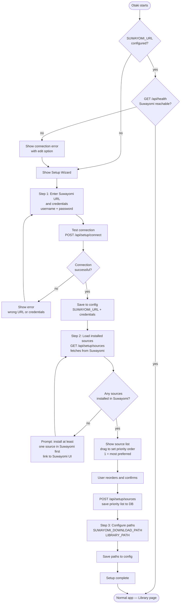
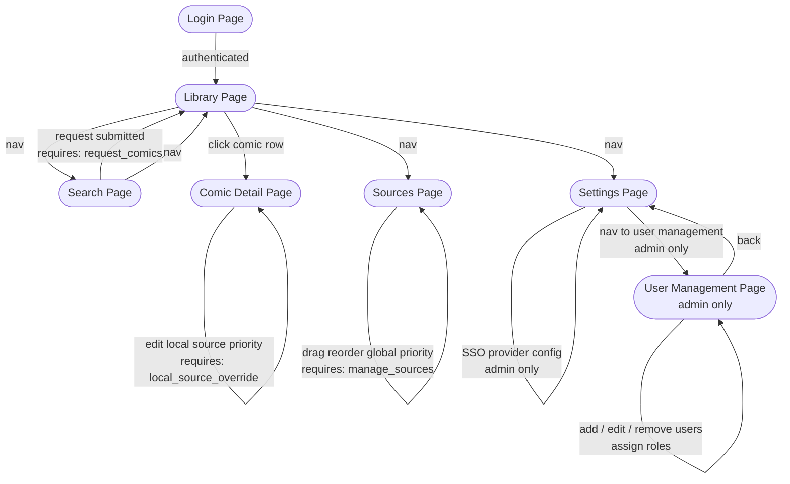
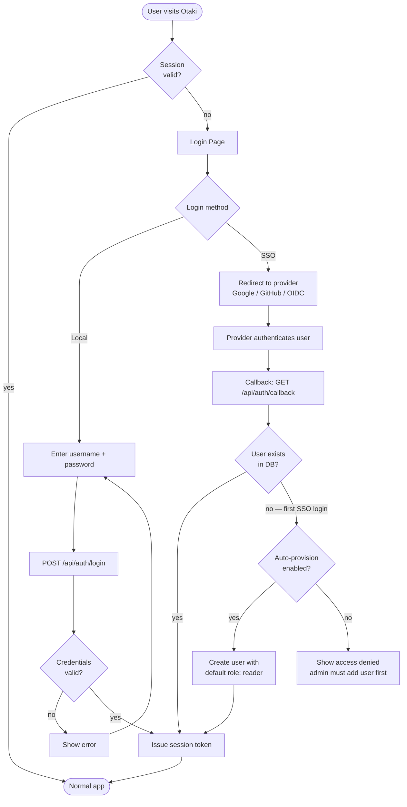
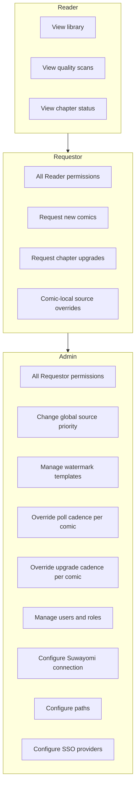
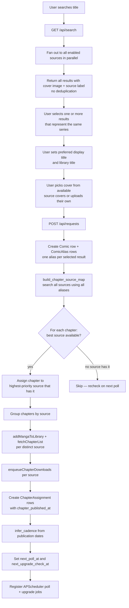
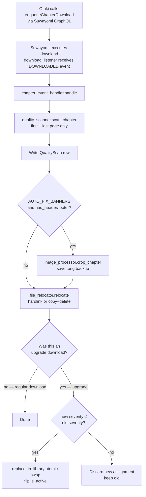
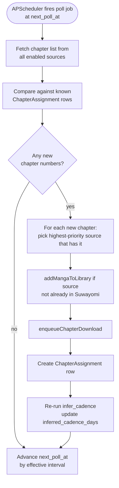
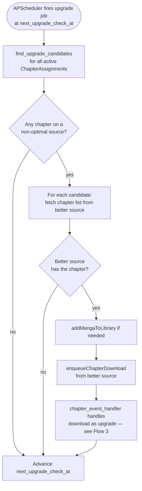
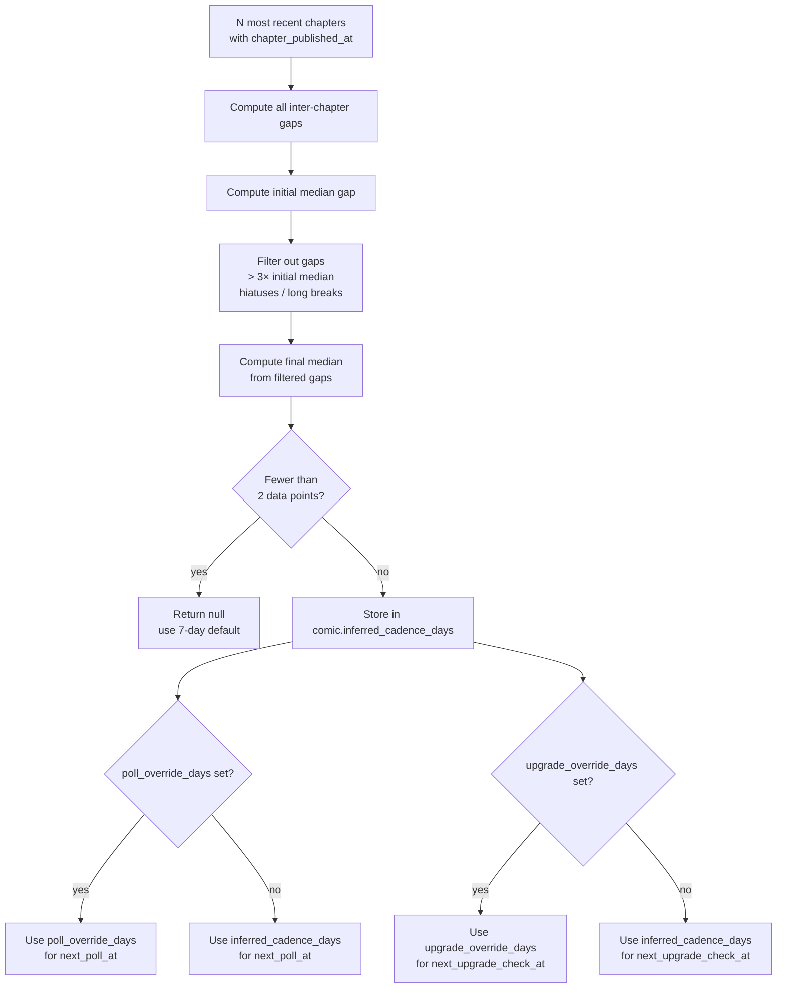
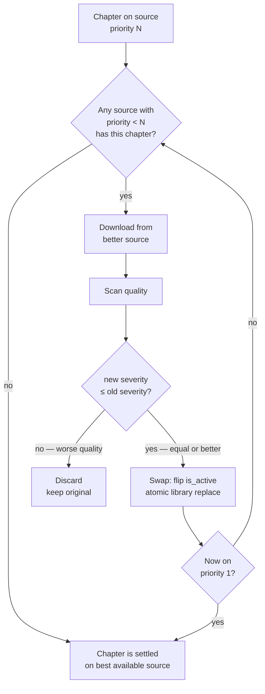

# Flows

Mermaid diagrams for key UI/UX and logic flows.

---

## 0. First-Time Setup

---

## 1. UI Navigation

---

## 1a. Authentication Flow

---

## 1b. Permission Roles

---

## 2. Request Submission Flow

---

## 3. Chapter Download Lifecycle

---

## 4. Poll Job — New Chapter Detection

---

## 5. Upgrade Check Job

---

## 6. Cadence Inference

---

## 7. Source Upgrade Decision

